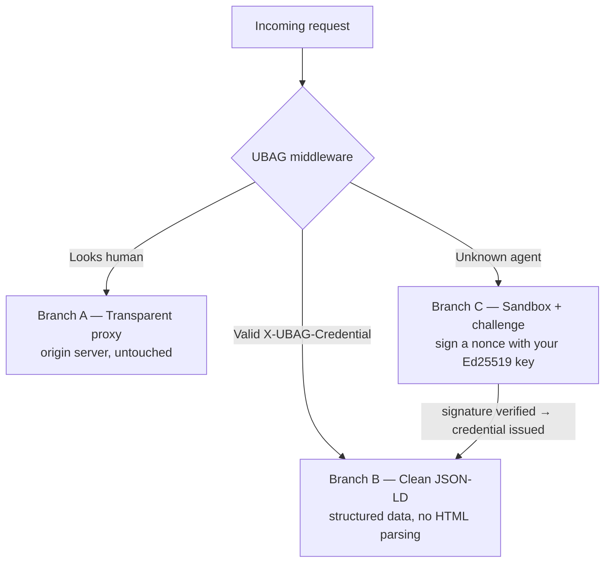

<div align="center">

<!-- Banner: save the UBAG Weblayer logo as docs/banner.png, then uncomment the line below -->
<!--  -->

# UBAG Web Layer

**Universal Behavioral Authorization Gateway — Web Layer**

[](https://github.com/mohameduk/Ubag_protocol/actions/workflows/ci.yml)
[](https://pypi.org/project/ubag/)
[](https://www.npmjs.com/package/ubag-web)
[](LICENSE)
[](#project-status)

**Agent identity and routing at the web edge. The open reference implementation.**

</div>

When an autonomous agent visits a website, UBAG verifies *who it is* and routes
accordingly: humans to your normal site, credentialed agents to clean JSON-LD,
unknown bots to a cryptographic challenge. MCP standardized how agents talk to
tools — it left a gap at the web layer: agent identity when no human is in the
loop. This is that layer.

> **Where this fits.** UBAG has two layers. The **Gateway** governs what an agent
> is allowed to *do* against credentialed systems and MCP tools; this **Web Layer**
> governs how an agent *reaches* a website. This repo is the open, MIT-licensed
> reference implementation of the Web Layer — and of an open mechanism any site can
> adopt (`ubag.json` discovery + a sign-the-nonce challenge + `X-UBAG-Credential`),
> not a product you have to buy into.

> **Status:** early but real. Two published SDKs — `pip install ubag` (Python) and
> `npm install ubag-web` (Node) — sharing a cross-verifiable wire format.
> See [Project status](#project-status) for exactly what works today vs. what's planned.

---

## The Problem

When an autonomous MCP agent visits a website today:

- The website has no way to verify *who* it is
- It scrapes raw HTML like any bot from 2005
- Unknown agents get blocked by Cloudflare — including legitimate ones
- No human is in the loop to click "Allow"

MCP's OAuth 2.1 spec is built for **human-delegated** auth (browser → redirect → user clicks Allow). It does not cover **autonomous agent identity** — the credential an agent carries when no human is in the loop.

UBAG fills that gap.

---

## How It Works

Every request to a UBAG-enabled site is routed through a 3-branch matrix:



**Branch B is the key insight.** Instead of an agent crawling 50 pages to understand a business, UBAG serves one structured JSON-LD response — products, prices, policies, contacts. One request, no HTML parsing, far fewer extraction errors.

---

## Security Model

UBAG is **asymmetric — there are no shared secrets in the identity path:**

- **Agent identity = an Ed25519 keypair.** An agent's identity is the SHA-256 thumbprint of its public key (`ubag:…`). To get in, the agent signs the site's nonce with its *private* key; the site verifies with the *public* key. Only the holder of the key can pass — knowing a shared secret never establishes *who* an agent is.
- **Credentials = ES256 JWTs** signed by an issuer's EC P-256 private key and verifiable by any site with the issuer's *public* key — auto-served as JWKS at `/.well-known/jwks.json`. No site needs a secret to validate a credential — the same model as OAuth / OIDC, which is what lets one credential work across independent sites.
- **Proof-of-possession ready.** Each credential binds to the agent's key via the `cnf` claim, so a verifier can require the bearer to prove it still holds the matching private key.
- **One server-side HMAC**, used only so the site can confirm it issued a given nonce **without storing state** (the server signing to *itself*). It is *not* part of the identity proof.

The Python and Node SDKs share identical wire formats (raw Ed25519 + ES256), so a signature or credential produced by one verifies byte-for-byte in the other. This interop is covered by tests in both packages.

---

## Install

```bash
# Python (FastAPI / Starlette)
pip install "ubag[fastapi]"

# Node (Express)
npm install ubag-web
```

> The npm package is **`ubag-web`** (npm reserves the bare `ubag`); the Python
> package is **`ubag`**. Same protocol, identical wire format.

Or from source: `git clone` the repo, then `pip install -e ".[fastapi]"` in
`ubag-python/` and `npm install` in `ubag-node/`.

---

## Quick Start — Python (FastAPI)

```python
from fastapi import FastAPI
from ubag import UBAGMiddleware, generate_issuer_keypair

# Your site is its own credential issuer. Generate once and persist these
# (or run verify-only by passing issuer_public_key alone).
ISSUER_PRIVATE, ISSUER_PUBLIC = generate_issuer_keypair()   # EC P-256 (ES256)

app = FastAPI()
app.add_middleware(
    UBAGMiddleware,
    origin="https://yoursite.com",   # Branch A proxy target
    issuer_key=ISSUER_PRIVATE,       # mints + verifies agent credentials
    server_secret="a-random-32+char-string-for-nonce-stamping",
    site_meta={"name": "My Store", "type": "Store", "description": "We sell widgets"},
)
```

`issuer_key` can also come from the `UBAG_ISSUER_KEY` env var; a verify-only
deployment can pass `issuer_public_key` (or `UBAG_ISSUER_PUBLIC`) alone.

Your site now:

- ✅ Serves clean JSON-LD to credentialed MCP agents (Branch B)
- ✅ Proxies humans transparently to your origin (Branch A)
- ✅ Sandboxes unknown agents with an Ed25519 nonce challenge (Branch C)
- ✅ Serves `yoursite.com/.well-known/ubag.json` for agent discovery
- ✅ Calls your optional `audit_fn(branch, request, response)` on every visit

## Quick Start — Node (Express)

```js
const express = require('express');
const { ubag, generateIssuerKeypair } = require('ubag-web');

const { privateKey: ISSUER_PRIVATE } = generateIssuerKeypair();  // EC P-256 (ES256)

const app = express();
app.use(ubag({
  origin: 'https://yoursite.com',
  issuerKey: ISSUER_PRIVATE,
  serverSecret: 'a-random-32+char-string-for-nonce-stamping',
  siteMeta: { name: 'My Store', type: 'Store', description: 'We sell widgets' },
}));
```

---

## See it work (60 seconds)

Runnable end-to-end demos spin up a UBAG site in-process and walk one agent
through the whole handshake — *blocked → challenged → signs the nonce →
credentialed → served JSON-LD* — then print the JWKS another site would use to
verify the credential:

```bash
# Python
cd ubag-python && pip install -e ".[fastapi]" && python ../examples/demo.py

# Node
npm install --prefix ubag-node && node examples/demo.js
```

---

## For MCP Agent Developers

If you're building an MCP agent that visits websites, get a UBAG credential:

```python
from ubag import AgentCredential

# Your agent's identity IS its Ed25519 keypair. Generate once; persist agent.export().
agent = AgentCredential.generate(owner="you@email.com")

# When a UBAG site challenges you (HTTP 429), sign the nonce and post it back:
#   challenge = resp.json()["ubag_challenge"]   # nested in the 429 body: nonce, timestamp, stamp
#   solution  = agent.solve_challenge(challenge)   # signs the nonce with your private key
#   r = httpx.post(f"{site}/ubag/verify", json=solution)
#   agent.set_credential(r.json()["credential"])

# Once credentialed, it travels with every request:
headers = agent.headers()
# {"X-UBAG-Credential": "eyJ..."}
```

UBAG-enabled sites recognize your agent and serve structured data instead of HTML. Your agent gets better data; the website owner gets visibility and control. The Node SDK exposes the same `AgentCredential` API.

---

## Discovery: `/.well-known/ubag.json`

Every UBAG-enabled site serves a discovery document at `/.well-known/ubag.json`
(with `/agents.json` kept as a legacy alias). It's deliberately **not** named
`agents.json` — that filename is already claimed by unrelated specs (Wildcard's
OpenAPI-style `agents.json`, Google/Microsoft/HF's ARD, etc.); `ubag.json` keeps
UBAG's identity/routing document collision-free and unambiguous.

```json
{
  "ubag_version": "1.0",
  "host": "yoursite.com",
  "credential_endpoint": "https://yoursite.com/ubag/verify",
  "branches": {
    "B-AGENT":   { "description": "Authorized MCP agents — clean JSON-LD",
                   "requires": "X-UBAG-Credential header with valid JWT",
                   "content_type": "application/ld+json" },
    "A-HUMAN":   { "description": "Human browsers — transparently proxied to origin",
                   "requires": "None" },
    "C-SANDBOX": { "description": "Unknown agents — Ed25519 nonce challenge",
                   "requires": "None — solve challenge to get credentialed",
                   "challenge_endpoint": "/ubag/verify" }
  },
  "discovery": {
    "ubag_json": "https://yoursite.com/.well-known/ubag.json",
    "verify_endpoint": "https://yoursite.com/ubag/verify",
    "jwks_endpoint": "https://yoursite.com/.well-known/jwks.json"
  }
}
```

Like `robots.txt`, but machine-actionable — agents fetch it before making requests.

---

## Why Not Just Use Cloudflare?

| | Cloudflare | AWS WAF | UBAG |
|---|---|---|---|
| Blocks unknown bots | ✅ | ✅ | Challenges them instead |
| Structured data for agents | Markdown (AI features) | ❌ | ✅ JSON-LD |
| Cryptographic agent identity / credential | ❌ | ❌ | ✅ |
| Autonomous agent support (no browser) | ❌ | ❌ | ✅ |
| Open source | ❌ | ❌ | ✅ |
| Vendor lock-in | Cloudflare | AWS | None |

Cloudflare and AWS block or filter bots. UBAG **graduates** them: an unknown agent can solve the challenge, get credentialed, and become authorized — no legitimate agent is permanently blocked. *(Competitor columns reflect general capabilities at time of writing; verify against current vendor docs.)*

---

## MCP Integration

UBAG complements MCP, it doesn't replace it:

- **MCP OAuth 2.1** — human-delegated auth (user clicks Allow in a browser)
- **UBAG credential** — autonomous agent identity (no human in the loop)

```
MCP Agent
    │
    ├── Talking to MCP servers?  ──► MCP OAuth 2.1
    │
    └── Visiting websites?  ────────► UBAG credential
```

A UBAG credential is issued once and verified in-process by the site's middleware — no redirect, no browser flow — and works on any UBAG-enabled site.

---

## Repository Layout

```
ubag-python/    Python middleware — FastAPI / Starlette today (v0.2.0)
ubag-node/      Node middleware — Express today (v0.2.0)
```

Both packages implement the full protocol (routing, credentials, challenge, keys,
ubag.json) and share a cross-verifiable wire format.

---

## Run the tests

```bash
# Python
cd ubag-python && pip install -e ".[dev]" && pytest

# Node
cd ubag-node && npm install && npm test
```

---

## Project status

**Working today**
- [x] Branch A — human transparent proxy
- [x] Branch B — agent JSON-LD structured data
- [x] Branch C — sandbox + Ed25519 nonce challenge
- [x] Asymmetric crypto — Ed25519 agent identity + ES256/JWKS credentials, no shared secrets
- [x] `ubag.json` discovery — served on every UBAG site (alias: `/agents.json`)
- [x] Audit hook — `audit_fn` callback on every request
- [x] Python SDK (FastAPI/Starlette) + Node SDK (Express), cross-SDK verified
- [x] Published — `pip install ubag` (PyPI) and `npm install ubag-web` (npm)

**Planned / not yet built**
- [ ] Django / Flask / Next.js middleware adapters
- [ ] Hosted credential registry / issuer at `ubagprotocol.com/credential`
- [ ] WordPress plugin
- [ ] Docker reference deployment (one-command self-host)
- [ ] Formal spec docs (`docs/spec/…`)
- [ ] Payment / revenue-share layer for site owners

---

## Contributing

PRs welcome. The goal isn't to make everyone adopt "UBAG" — it's to make the *mechanism* easy to adopt: `ubag.json` discovery, a sign-the-nonce challenge, and a portable `X-UBAG-Credential` that any site can verify without a shared secret. Open, verifiable, and not owned by any cloud provider. UBAG is just the reference implementation.

---

## Contact

Built by Mohamed Ben Hadj Hmida
[ubagprotocol.com](https://ubagprotocol.com) · [github.com/mohameduk/Ubag_protocol](https://github.com/mohameduk/Ubag_protocol)

MIT licensed.
