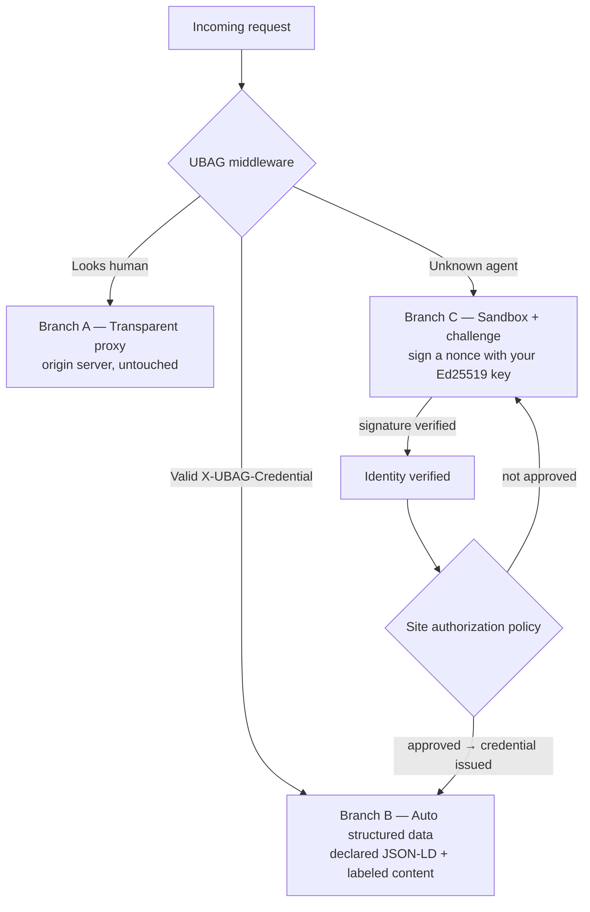

<div align="center">


# UBAG Web Layer

**Universal Behavioral Authorization Gateway — Web Layer**

[](https://github.com/mohameduk/Ubag_protocol/actions/workflows/ci.yml)
[](https://pypi.org/project/ubag/)
[](https://www.npmjs.com/package/ubag-web)
[](LICENSE)
[](#project-status)

**Agent identity and routing at the web edge. The open reference implementation.**

</div>

When an autonomous agent visits a website, UBAG verifies *who it is* and routes
accordingly: humans to your normal site, credentialed agents to clean JSON-LD,
unknown automation to a cryptographic challenge. MCP standardized how agents talk to
tools — it left a gap at the web layer: agent identity when no human is in the
loop. This is that layer.

> **Where this fits.** UBAG has two layers. The **Gateway** governs what an agent
> is allowed to *do* against credentialed systems and MCP tools; this **Web Layer**
> governs how an agent *reaches* a website. This repo is the open, MIT-licensed
> reference implementation of the Web Layer — and of an open mechanism any site can
> adopt (`ubag.json` discovery + a sign-the-nonce challenge + `X-UBAG-Credential`),
> not a product you have to buy into.

> **Status:** early but real. Two published SDKs — `pip install ubag` (Python) and
> `npm install ubag-web` (Node) — sharing a cross-verifiable wire format.
> See [Project status](#project-status) for exactly what works today vs. what's planned.

---

## The Problem

When an autonomous MCP agent visits a website today:

- The website has no way to verify *who* it is
- It scrapes raw HTML like any bot from 2005
- Unknown automated clients are often blocked or served browser-only challenges
- No human is in the loop to click "Allow"

Many web authorization flows assume a human can complete a browser redirect and consent screen. Autonomous agent identity needs a non-visual proof and an explicit site policy when no human is present.

UBAG fills that gap.

---

## How It Works

Every request to a UBAG-enabled site is routed through a 3-branch matrix:



**Branch B is the key insight.** Instead of an agent crawling 50 pages to understand a business, UBAG serves one structured response — products, prices, policies, contacts. One request, no HTML parsing, far fewer extraction errors.

And it's **zero-config**: point UBAG at your origin and it automatically harvests the structured data your site *already publishes* for search engines (JSON-LD, OpenGraph, meta) — no hand-written metadata required. See [Branch B: automatic structured data](#branch-b-automatic-structured-data).

---

## Branch B: automatic structured data

Most sites already publish structured data for Google — `<script type="application/ld+json">`, OpenGraph, meta tags. UBAG re-serves that to authorized agents automatically. **Point it at your origin and Branch B just works; `site_meta` is optional.**

What an agent receives is one JSON-LD envelope with a **machine-readable trust boundary**:

```jsonc
{
  "@context": "https://schema.org",
  "@type": "Product",                 // ← declared: the owner's own JSON-LD/OG
  "name": "Blue Widget",
  "ubag:declared": [ /* the site's JSON-LD, passed through verbatim */ ],
  "ubag:content": {                    // ← inferred: readable page text
    "format": "markdown",
    "source": "extracted",            //   explicitly NOT verified structured data
    "text": "# Blue Widget\n\nThe **best** blue widget…"
  },
  "ubag:provenance": {
    "confidence": "mixed",            // declared | extracted | mixed
    "sources": ["json-ld", "opengraph", "content-markdown"],
    "fields_from_site_meta": []
  }
}
```

Two tiers, by **confidence, not depth**:

1. **Declared → typed JSON-LD.** Parsed from the site's own JSON-LD / OpenGraph / meta and passed through under `ubag:declared`. 100% owner-authored — nothing is inferred, so an agent can act on it.
2. **Everything else → labeled Markdown.** Readable page content (boilerplate stripped) served as `ubag:content` with `source: "extracted"`. UBAG deliberately does **not** guess types for prose — a regex that calls `$19.99` a "price" is a lie an agent would act on. Instead it hands over honest text, clearly marked as unverified.

That labeling is the point: unlike a generic HTML-to-Markdown reader, UBAG tells the agent **which parts are site-declared facts and which are extracted page text**. Declared data is attributable to the publisher, not independently guaranteed as true. `site_meta` still works — it *overrides* the auto-extracted fields and is the escape hatch for declaring data your page doesn't expose.

**Options** (all optional): `auto_extract` (default on), `include_markdown` / `includeMarkdown` (default on), `content_max_chars` / `contentMaxChars` (default 20000), and `extract_cache_ttl` / `extract_cache_size` for the bounded HTML cache. Set `auto_extract=False` for the classic manual-`site_meta` behavior.

> Parity note: the declared JSON-LD is byte-identical across the Python and Node SDKs (verified by a shared golden fixture). The Markdown text is deterministic within each SDK and semantically equivalent across them, but not promised byte-identical (HTML-to-text differs by parser).

---

## Security Model

UBAG is **asymmetric — there are no shared secrets in the identity path:**

- **Agent identity = an Ed25519 keypair.** An agent's identity is the SHA-256 thumbprint of its public key (`ubag:…`). To get in, the agent signs the site's nonce with its *private* key; the site verifies with the *public* key. Only the holder of the key can pass — knowing a shared secret never establishes *who* an agent is.
- **Identity verification is not authorization.** Passing the nonce challenge proves control of a stable key. A site authorizes that identity through an explicit policy callback; self-registration is disabled by default.
- **Credentials = ES256 JWTs** signed by an issuer's EC P-256 private key and verified by sites that explicitly trust that issuer's public key, expected issuer, and audience. JWKS makes verification possible; it does not create issuer trust automatically.
- **Proof-of-possession is required by default.** The v2 proof binds method, host, path plus query, credential thumbprint, timestamp, and a one-time identifier that the gateway consumes to reject replay.
- **A separate server-side HMAC secret** lets a site confirm it issued a nonce without storing every challenge before redemption. Successful redemption is recorded to enforce one-time use. The secret is required and is never derived from the issuer key.

The Python and Node SDKs share identical wire formats (raw Ed25519 + ES256), so a signature or credential produced by one verifies byte-for-byte in the other. This interop is covered by tests in both packages.

---

## Install

```bash
# Python (FastAPI / Starlette)
pip install "ubag[fastapi]"

# Node (Express)
npm install ubag-web
```

> The npm package is **`ubag-web`** (npm reserves the bare `ubag`); the Python
> package is **`ubag`**. Same protocol, identical wire format.

Or from source: `git clone` the repo, then `pip install -e ".[fastapi]"` in
`ubag-python/` and `npm install` in `ubag-node/`.

---

## Quick Start — Python (FastAPI)

```python
from fastapi import FastAPI
from ubag import UBAGMiddleware, generate_issuer_keypair

# Your site is its own credential issuer. Generate once and persist these
# (or run verify-only by passing issuer_public_key alone).
ISSUER_PRIVATE, ISSUER_PUBLIC = generate_issuer_keypair()   # EC P-256 (ES256)

TRUSTED_AGENTS = {"ubag:replace-with-an-approved-agent-id"}
def authorize_agent(identity, request):
    return identity["agent_id"] in TRUSTED_AGENTS

app = FastAPI()
app.add_middleware(
    UBAGMiddleware,
    origin="https://yoursite.com",   # Branch A proxy target + Branch B auto-extraction source
    issuer_key=ISSUER_PRIVATE,       # mints + verifies agent credentials
    server_secret="a-random-32+char-string-for-nonce-stamping",
    authorize_agent=authorize_agent, # identity must pass site policy before minting
    # site_meta is now OPTIONAL — Branch B auto-extracts from your origin's HTML.
    # Pass it only to override or supplement the auto-extracted fields:
    # site_meta={"name": "My Store", "type": "Store"},
)
```

`issuer_key` can also come from the `UBAG_ISSUER_KEY` env var; a verify-only
deployment can pass `issuer_public_key` (or `UBAG_ISSUER_PUBLIC`) instead. All
deployments still require a separate `server_secret` for challenge stamping.

Your site now:

- ✅ Serves credentialed MCP agents auto-extracted JSON-LD + labeled content (Branch B) — no hand-written metadata
- ✅ Proxies humans transparently to your origin (Branch A)
- ✅ Sandboxes unknown agents with an Ed25519 nonce challenge (Branch C)
- ✅ Serves `yoursite.com/.well-known/ubag.json` for agent discovery
- ✅ Calls your optional `audit_fn(branch, request, response)` on every visit

## Quick Start — Node (Express)

```js
const express = require('express');
const { ubag, generateIssuerKeypair } = require('ubag-web');

const { privateKey: ISSUER_PRIVATE } = generateIssuerKeypair();  // EC P-256 (ES256)
const TRUSTED_AGENTS = new Set(['ubag:replace-with-an-approved-agent-id']);

const app = express();
app.use(express.json());
app.use(ubag({
  origin: 'https://yoursite.com',
  issuerKey: ISSUER_PRIVATE,
  serverSecret: 'a-random-32+char-string-for-nonce-stamping',
  authorizeAgent: ({ agentId }) => TRUSTED_AGENTS.has(agentId),
  // siteMeta is OPTIONAL — Branch B auto-extracts from your origin's HTML.
  // Pass it only to override or supplement: siteMeta: { name: 'My Store', type: 'Store' },
}));
```

---

## See it work (60 seconds)

Runnable end-to-end demos spin up a UBAG site in-process and walk one agent
through the whole handshake — *blocked → challenged → signs the nonce →
policy-approved → credentialed → served JSON-LD* — then print the issuer JWKS a trusting site could use to
verify the credential:

```bash
# Python
cd ubag-python && pip install -e ".[fastapi]" && python ../examples/demo.py

# Node
npm install --prefix ubag-node && node examples/demo.js
```

---

## For MCP Agent Developers

If you're building an MCP agent that visits websites, get a UBAG credential:

```python
from ubag import AgentCredential

# Your agent's identity IS its Ed25519 keypair. Generate once; persist agent.export().
agent = AgentCredential.generate(owner="you@email.com")

# When a UBAG site challenges you (HTTP 429), sign the nonce and post it back:
#   challenge = resp.json()["ubag_challenge"]   # nested in the 429 body: nonce, timestamp, stamp
#   solution  = agent.solve_challenge(challenge)   # signs the nonce with your private key
#   r = httpx.post(f"{site}/ubag/verify", json=solution)
#   agent.set_credential(r.json()["credential"])

# Once credentialed, attach headers per request. Credentials are holder-of-key:
# The v2 proof binds the credential and full request target and is one-time.
headers = agent.headers("GET", "https://example.com/products?limit=10")
# Includes X-UBAG-Credential, X-UBAG-PoP, X-UBAG-PoP-TS and X-UBAG-PoP-JTI.
```

Proof-of-possession is required by default. Disabling it with `require_pop=False` / `requirePop: false` is an explicit compatibility downgrade to bearer-token behavior. The Node SDK exposes the equivalent `agent.headers(method, url)` API.

---

## Discovery: `/.well-known/ubag.json`

Every UBAG-enabled site serves a discovery document at `/.well-known/ubag.json`
(with `/agents.json` kept as a legacy alias). It's deliberately **not** named
`agents.json` — that filename is already claimed by unrelated specs (Wildcard's
OpenAPI-style `agents.json`, Google/Microsoft/HF's ARD, etc.); `ubag.json` keeps
UBAG's identity/routing document collision-free and unambiguous.

```json
{
  "ubag_version": "1.0",
  "host": "yoursite.com",
  "credential_endpoint": "https://yoursite.com/ubag/verify",
  "branches": {
    "B-AGENT":   { "description": "Authorized MCP agents — clean JSON-LD",
                   "requires": "Trusted JWT plus v2 proof-of-possession",
                   "content_type": "application/ld+json" },
    "A-HUMAN":   { "description": "Human browsers — transparently proxied to origin",
                   "requires": "None" },
    "C-SANDBOX": { "description": "Unknown agents — Ed25519 nonce challenge",
                   "requires": "Solve challenge to verify identity; site policy controls credential issuance",
                   "challenge_endpoint": "/ubag/verify" }
  },
  "discovery": {
    "ubag_json": "https://yoursite.com/.well-known/ubag.json",
    "verify_endpoint": "https://yoursite.com/ubag/verify",
    "jwks_endpoint": "https://yoursite.com/.well-known/jwks.json"
  }
}
```

Like `robots.txt`, but machine-actionable — agents fetch it before making requests.

---

## Relationship to WAFs and bot management

UBAG is not a replacement for a WAF, DDoS protection, rate limiting, or bot
management. Those systems protect the network and application perimeter. UBAG
adds a protocol-level flow for establishing a stable autonomous-agent identity,
applying a site authorization policy, and serving an agent-oriented response.

An unknown client that solves the nonce challenge becomes **cryptographically
identified**, not automatically trusted. Credential issuance requires the site's
authorization policy unless the operator explicitly enables low-trust
self-registration.

---

## MCP Integration

UBAG complements MCP, it doesn't replace it:

- **MCP OAuth 2.1** — human-delegated auth (user clicks Allow in a browser)
- **UBAG credential** — autonomous agent identity (no human in the loop)

```
MCP Agent
    │
    ├── Talking to MCP servers?  ──► MCP OAuth 2.1
    │
    └── Visiting websites?  ────────► UBAG credential
```

A UBAG credential is issued without a browser redirect and verified in-process. It can be accepted by another UBAG-enabled site only when that site explicitly trusts the issuer and configures the expected issuer, audience, and public key.

---

## Repository Layout

```
ubag-python/    Python middleware — FastAPI / Starlette
ubag-node/      Node middleware — Express
```

Both packages implement the full protocol (routing, credentials, challenge, keys,
ubag.json) and share a cross-verifiable wire format.

---

## Run the tests

```bash
# Python
cd ubag-python && pip install -e ".[dev]" && pytest

# Node
cd ubag-node && npm install && npm test
```

---

## Project status

**Working today**
- [x] Branch A — human transparent proxy
- [x] Branch B — agent structured data, **auto-extracted** from the origin (JSON-LD/OG/meta) with zero config
- [x] Branch B content layer — readable page text as labeled Markdown (`ubag:content`, `source: extracted`) with a machine-readable trust boundary
- [x] Branch C — sandbox + Ed25519 nonce challenge
- [x] Asymmetric crypto — Ed25519 agent identity + ES256/JWKS credentials, no shared secrets
- [x] Holder-of-key credentials — per-request proof-of-possession (default on), upstream TLS verification
- [x] Identity/authorization separation — explicit policy callback; self-registration off by default
- [x] Enforced credential paths, issuer/audience validation, bounded replay stores, and verification limits
- [x] `ubag.json` discovery — served on every UBAG site (alias: `/agents.json`)
- [x] Audit hook — `audit_fn` callback on every request
- [x] Python SDK (FastAPI/Starlette) + Node SDK (Express), cross-SDK verified
- [x] Published — `pip install ubag` (PyPI) and `npm install ubag-web` (npm)

**Planned / not yet built**
- [ ] Django / Flask / Next.js middleware adapters
- [ ] Hosted trust registry, revocation service, and issuer federation
- [ ] WordPress plugin
- [ ] Docker reference deployment (one-command self-host)
- [ ] Formal spec docs (`docs/spec/…`)
- [ ] Payment / revenue-share layer for site owners

---

## Contributing

PRs welcome. The goal isn't to make everyone adopt "UBAG" — it's to make the *mechanism* easy to adopt: `ubag.json` discovery, a sign-the-nonce identity challenge, explicit site authorization, and an `X-UBAG-Credential` that trusted issuers and sites can verify without a shared secret. Open, verifiable, and not owned by any cloud provider. UBAG is the reference implementation.

---

## Contact

Built by Mohamed Ben Hadj Hmida
[ubagprotocol.com](https://ubagprotocol.com) · [github.com/mohameduk/Ubag_protocol](https://github.com/mohameduk/Ubag_protocol)

MIT licensed.
